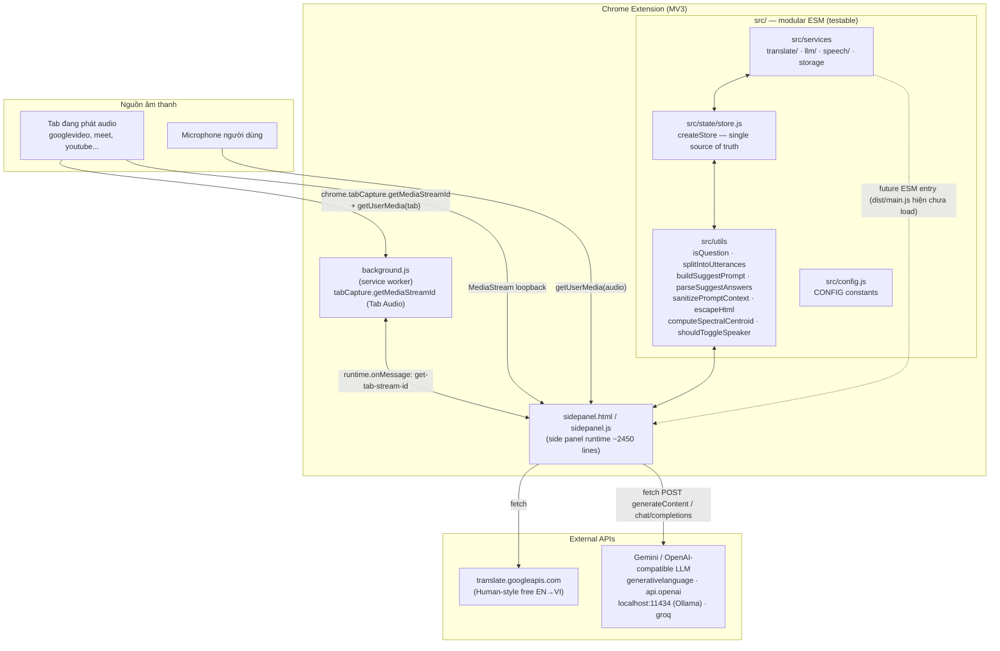
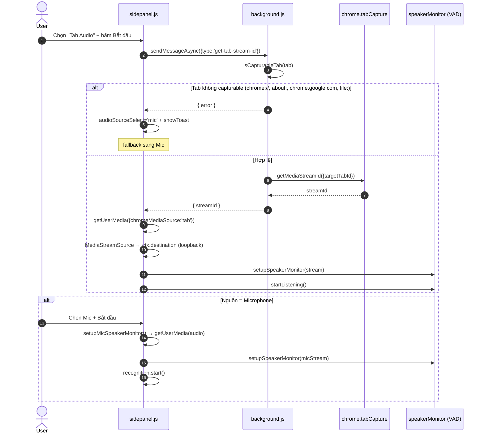
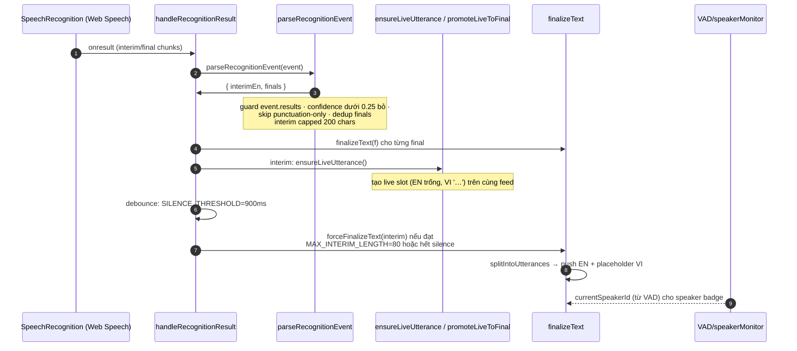
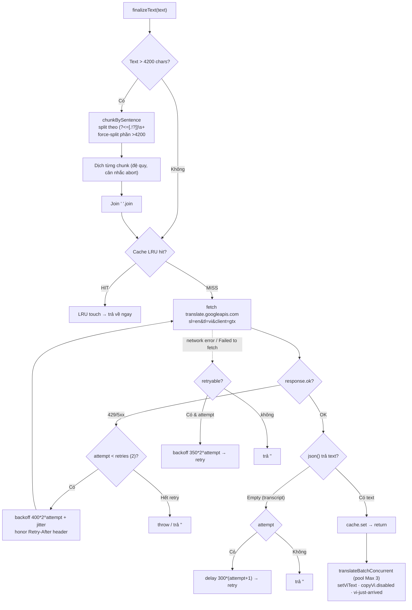
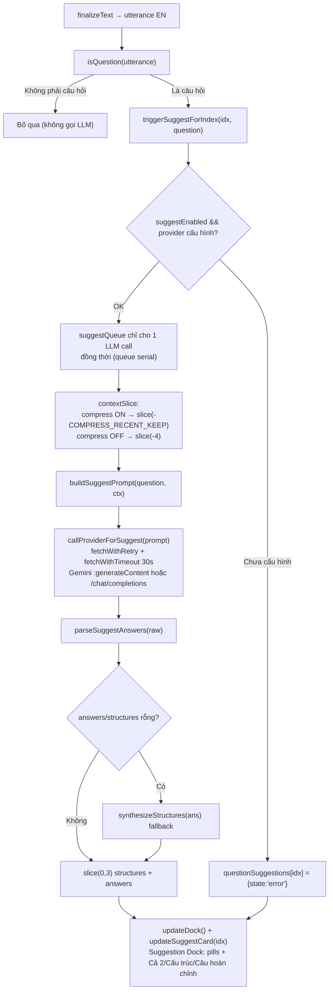
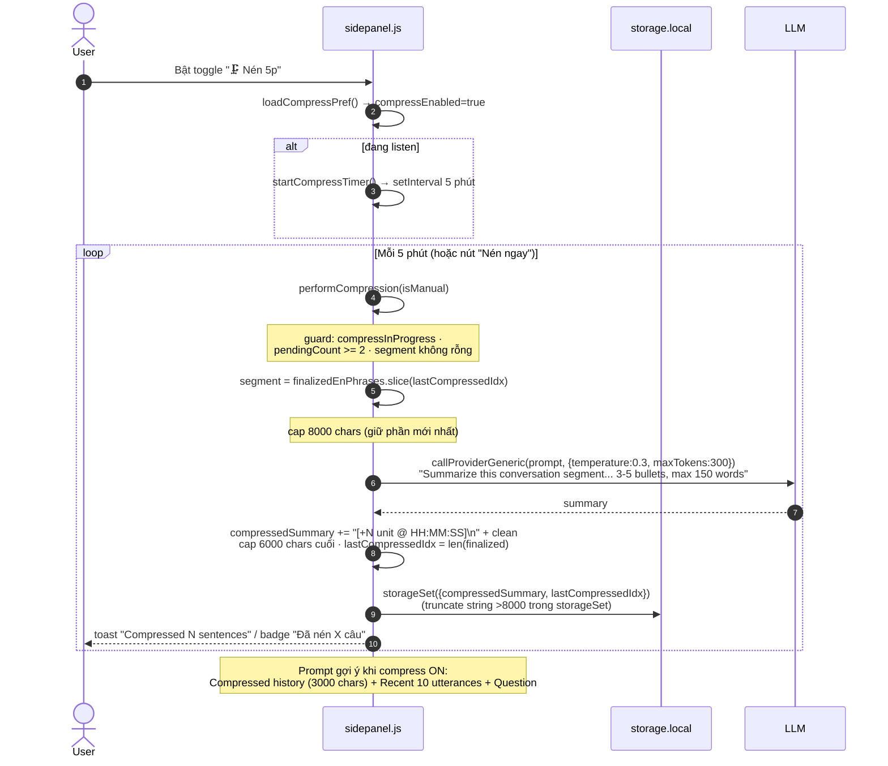
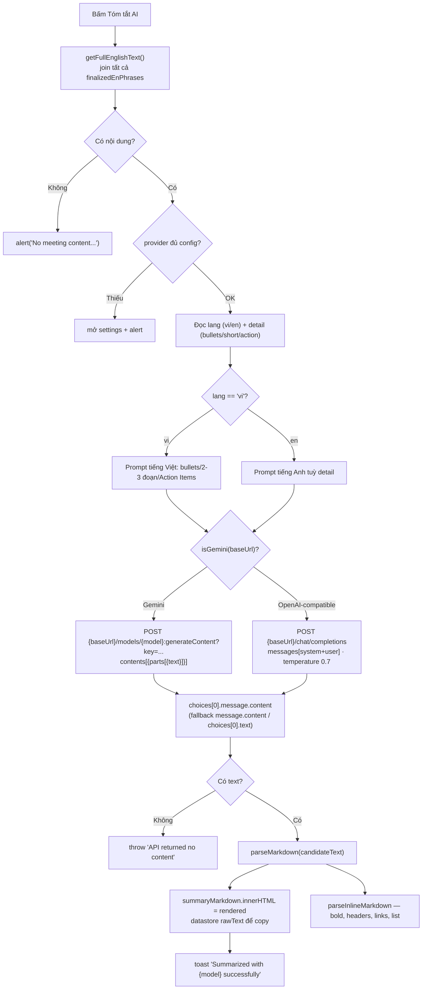
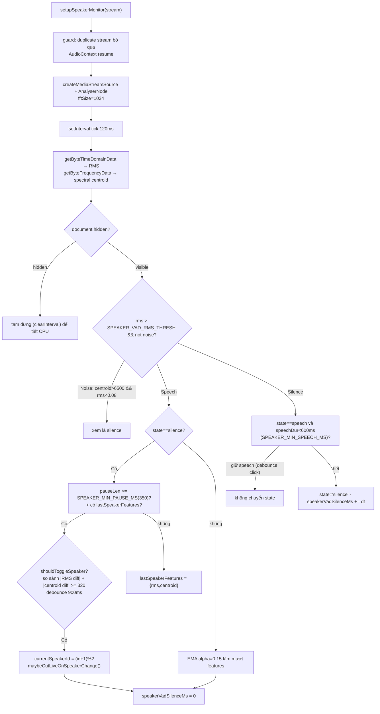
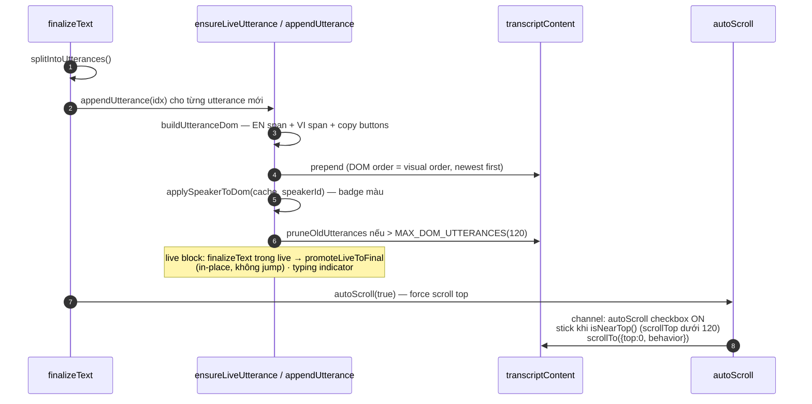

# Live Translate (EN → VI) — Chrome Side Panel Extension

Real-time English speech-to-text + Vietnamese translation + AI-powered suggested answers in Chrome Side Panel. Hỗ trợ **Tab Audio** (`chrome.tabCapture`) và **Microphone**; dịch tự động qua **Google Translate free API**; gợi ý trả lời, nén lịch sử 5 phút và tóm tắt cuộc họp qua **Gemini / OpenAI-compatible provider** (OpenAI, Ollama, Groq).

Version **1.0.1** · MV3 · MIT

---

## Tổng quan kiến trúc



> **Ghi chú quan trọng:** file chạy thực tế là **`sidepanel.js`** (không module, load trực tiếp trong `sidepanel.html`). Các module **`src/`** là bản tái cấu trúc tương đương, được Vitest test và Vite build thành `dist/main.js` — nhưng `sidepanel.html` **đang comment out** thẻ `<script type="module" src="dist/main.js">` nên `src/` hiện là code chết về runtime. Hai bản phải là ảnh phản chiếu (mirror). Các chỉnh sửa sau đây đều sync cả 2 nơi.

---

## Features

- **Realtime Transcription**: Web Speech API (`en-US`, `continuous` + `interimResults`), `SILENCE_THRESHOLD = 900ms`.
- **Dịch EN→VI tự động**: Google Translate free API per-utterance, chunking `>4200 chars`, retry/backoff, LRU cache 500 entry.
- **Tab Audio & Mic**: `chrome.tabCapture.getMediaStreamId` + loopback qua `AudioContext`, fallback sang mic nếu tab không capturable.
- **Gợi ý trả lời AI**: `isQuestion()` phát hiện câu hỏi → `buildSuggestPrompt()` → LLM → `parseSuggestAnswers()` → Suggestion Dock (Cả 2 / Cấu trúc / Câu hoàn chỉnh).
- **Rolling Compress 5 phút**: toggle `🗜️ Nén 5p` — nén lịch sử định kỳ 5 phút thành bullet summaries; prompt gợi ý sau đó dùng `compressed history + 10 câu gần nhất`.
- **Tóm tắt AI**: `generateSummary()` hỗ trợ Gemini native (`:generateContent`) và OpenAI-compatible (`/chat/completions`).
- **Speaker diarization heuristic**: VAD local (RMS + spectral centroid) để phân biệt 2 người nói.
- **UI**: feed transcript đơn (EN trắng / VI vàng), layout ngược — *newest on top*, live block + typing indicator, suggestion dock tách rời.

---

## Flow 1 — Khởi động & Capture (Tab Audio / Mic)



`isCapturableTab` (mirror trong `background.js:11` và `src/background/isCapturableTab.js`):
- Chỉ cho `http:` / `https:`.
- Chặn `chrome://`, `chrome-extension://`, `about:`, `edge://`, `file:`.
- Chặn host `chrome.google.com`, `chromewebstore.google.com`, `accounts.google.com`.

---

## Flow 2 — STT → Utterance → Live block



**Xử lý error / auto-restart** (`handleRecognitionError` / `handleRecognitionEnd`):

| Error | Xử lý |
|---|---|
| `not-allowed` / `service-not-allowed` | hiện Permission overlay + dừng |
| `no-speech` / `aborted` | bỏ qua, auto-restart |
| `audio-capture` | toast "Mic not found" + dừng |
| `network` | toast "STT network error — retrying", giữ chạy |
| khác | toast + dừng |

`onend` → nếu vẫn đang listen: reset `lastFinalIndex=-1`, auto-restart sau **300ms**.

---

## Flow 3 — Dịch EN→VI (Google Translate + chunk + retry + LRU)



**Chi tiết mô-đun `src/services/translate/`:**

| File | Vai trò |
|---|---|
| `translate.js` | `translateText()` — chunking 4200, retry 2 lần (429/5xx/network/empty), timeout `TRANSLATE_TIMEOUT_MS=8500`, link external abort, `_internals` cho test |
| `cache.js` | `createTranslateCache(limit=500)` — LRU thật, `safeLimit` clamp 1..2000, `get/set/has/delete/clear/size/keys` |
| `batch.js` | `translateBatchConcurrent(tasks, {concurrency=3})` — worker pool, bỏ qua task đã có VI, `'[Translation failed]'` không đánh dấu là giá trị cuối, `results.failed` telemetry |

> (Bản `sidepanel.js:1419` giữ logic tương đương nội bộ — sync thủ công.)

---

## Flow 4 — Phát hiện câu hỏi & Gợi ý trả lời AI



**`isQuestion()` — các lớp phát hiện** (`sidepanel.js:717`, `src/utils/isQuestion.js`):

1. Nhanh: có `?` → true.
2. `window.nlp` (compromise) nếu có → `doc.questions()`.
3. Loại trừ cảm thán: `What a ...!`, `How great ...!`.
4. **Declarative trap** `RE_DECLARATIVE_FALSE`: `This is correct.` không phải câu hỏi (trừ khi có tag/trailing `or`/embedded).
5. `RE_WH_START`: `who/what/when/where/why/how/which/...` + contraction `what's|how's|...` (≥2 từ, không kết thúc `!`).
6. `RE_AUX_START`: đảo trợ động từ `is|are|do|does|did|can|could|will|would|have|...`.
7. `RE_TAG_Q`: `, right?`, `, isn't it?`, `, yeah?`, `, huh?`.
8. `RE_EMBEDDED`: `do you|can you|would you mind|could you tell|...` (≥4 từ).
9. `RE_INDIRECT`: `do you know|tell me|any chance|let me know|...` (≥3 từ).
10. `RE_TRAILING_OR`: `or not|or what|or something|anything|somewhere` (≥4 từ).

**`buildSuggestPrompt()`** — chống injection: `sanitizePromptContext` thay `"""` → `"'"` trước khi nhúng vào block prompt; `truncateForPrompt` giới hạn recent ctx (1500 chars nén / 1000 chars thường).

**Provider** (`src/services/llm/provider.js`):
- `fetchWithTimeout(url, opts, timeout)` — internal AbortController link external `signal`.
- `fetchWithRetry(url, opts, timeout, maxRetries=2)` — retry 429/500/502/503/504 + `Retry-After`, drain body.
- `callProviderForSuggest` — systemPrompt bắt buộc "ONLY JSON" (OpenAI-compatible), Gemini dùng `temperature 0.8, maxOutputTokens 512`.
- `callProviderGeneric(prompt, cfg, {temperature=0.4, maxTokens=512, systemPrompt, timeout=25000})` — dùng cho compress.

**`parseSuggestAnswers()`** — strip code fence json wrapper (cả khối `` ```json ... ``` ``), `tryParseJson` (xoá trailing comma), nhận `{structures,answers}` hoặc mảng đơn, fallback bullet lines (≥3 ký tự), giới hạn 5.

---

## Flow 5 — Rolling Compress 5 phút (context-aware suggestions)



**Khi compress bật**, `triggerSuggestForIndex` lấy `contextSlice = finalizedEnPhrases.slice(max(0, idx-COMPRESS_RECENT_KEEP+1), idx+1)` (10 câu) thay vì 4.

---

## Flow 6 — Tóm tắt AI (Summary)

> Không thay đổi theo spec — `generateSummary` / `parseMarkdown` / `parseInlineMarkdown` giữ nguyên.



`parseMarkdown` xử lý: `###`/`##` headers → `<h3>`/`<h4>`, `**bold**`, `- bullets`, `\`code\``, URLs → `<a target=_blank>`.

---

## Flow 7 — VAD & Speaker Diarization (heuristic)



---

## Flow 8 — Utterance → DOM (newest on top) & Scroll



**Chống XSS:** mọi nội dung người dùng/LLM đi qua `escapeHtml()` (`& < > " ' \``). `DOMPurify` có trong `package.json` và được import trong `src/main.js` (module mới), chưa được dùng trong `sidepanel.js` runtime.

---

## Cấu hình CONFIG (`src/config.js` ↔ `sidepanel.js` — mirror)

| Hằng số | Giá trị | Ý nghĩa |
|---|---|---|
| `SILENCE_THRESHOLD` | 900 ms | buộc finalize interim sau khi im lặng |
| `MAX_INTERIM_LENGTH` | 80 | finalize sớm nếu interim đạt 80 ký tự |
| `MAX_DOM_UTTERANCES` | 120 | prune DOM cũ khi vượt ngưỡng |
| `INTERIM_DEBOUNCE_MS` | 420 | debounce dịch interim (đã giảm từ 500) |
| `TRANSLATION_CACHE_MAX` | 500 | LRU size translate cache |
| `MAX_CONCURRENT_TRANSLATE` | 3 | pool dịch song song |
| `COMPRESS_INTERVAL_MS` | 5 phút | tần suất auto-compress |
| `COMPRESS_RECENT_KEEP` | 10 | số utterance gần nhất trong prompt nén |
| `COMPRESS_MAX_CHARS` | 3000 | cap compressedSummary khi build prompt |
| `SPEAKER_VAD_RMS_THRESH` | 0.012 | ngưỡng RMS xem là "có tiếng nói" |
| `SPEAKER_MIN_PAUSE_MS` | 350 | pause tối thiểu để tính speaker switch |
| `SPEAKER_MIN_SPEECH_MS` | 600 | speech tối thiểu trước khi chuyển silence |
| `SPEAKER_CENTROID_DIFF` | 320 | sai khác centroid tối thiểu để đổi speaker |
| `TRANSLATE_TIMEOUT_MS` | 8500 | timeout mỗi request dịch (đã tăng từ 8000) |

---

## Installation

1. Clone:

   ```bash
   git clone https://github.com/nbhson/app-live-translate-extension.git
   ```

2. Mở `chrome://extensions` → bật **Developer mode** → **Load unpacked** → chọn thư mục repo.
3. Click icon extension để mở Side Panel. Cấu hình AI Provider lần đầu trong `⚙️`.

## Cấu hình AI Provider

- **Base URL**: `https://generativelanguage.googleapis.com/v1beta` (Gemini) / `https://api.openai.com/v1` / `http://localhost:11434/v1` (Ollama) / `https://api.groq.com/openai/v1`.
- **API Key**: `AIza...` / `sk-...` (để trống nếu localhost).
- **Model**: `gemini-2.5-flash`, `gpt-4o-mini`, `llama3.1`, ...
- Lưu vào `chrome.storage.local` (`providerBaseUrl`, `providerApiKey`, `providerModel`). Preset chips 1-click. `isValidProviderConfig()` kiểm tra `http/https` + model non-empty.

## Usage

1. Chọn nguồn (Tab Audio / Microphone) → **Bắt đầu** (hoặc Space).
2. Nói tiếng Anh → transcript EN/VI realtime. Câu hỏi được highlight `?` + tự sinh gợi ý trong dock.
3. Bật `🗜️ Nén 5p` cho video dài (>15 phút) để gợi ý bám sát toàn bộ lịch sử.
4. Tab **Tóm tắt AI** → chọn `VI/EN` + `Chi tiết/Ngắn/Actions` → **Tóm tắt** → Copy.

### Phím tắt

- **Space** — Start/Stop (xem `setupKeyboardShortcuts`, `sidepanel.js:2396`).
- Nút copy trên mỗi viên gạch transcript / card gợi ý.

## Permissions

```
permissions:        sidePanel, activeTab, storage, tabCapture
host_permissions:   https://translate.googleapis.com/*, generativelanguage.googleapis.com/*,
                    api.openai.com/*, api.groq.com/*, http://localhost/*, http://127.0.0.1/*
optional_host:      https://*/*            (thêm nếu cần url tuỳ ý → validate bằng isValidUrl)
```

## Development

```bash
npm install
npm test               # vitest run --coverage  (9 suites / 61 tests)
npm run test:watch
npm run build          # vite build → dist/main.js (43.6 kB, gzip 14.7 kB)
node --check sidepanel.js   # syntax check runtime script
```

**Checklist khi sửa code:**
1. Giữ mi **mirror** `sidepanel.js` ↔ `src/` (cùng hành vi). Nếu sửa gì trong `src/`, sửa tương ứng `sidepanel.js`.
2. `npm test` không được fail.
3. `node --check sidepanel.js && npm run build`.
4. Reload extension: `chrome://extensions` → Reload → thử cả Tab Audio và Mic.

### Viết test

```
tests/
  buildSuggestPrompt.test.js      — 4 ctx vs compress 10 ctx + 3000 truncation, sanitize triple-quotes, context injection
  isQuestion.test.js              — 11 cases (?, WH-start, aux, tag, embedded, indirect, exclamation exclusions, declarative trap)
  splitIntoUtterances.test.js     — 8 cases (empty, punctuation, WH keep, mid-split how, abbrev merge Mr./Dr., Safari fallback)
  parseSuggestAnswers.test.js     — object/array/bullet fallback, limit 5, synthesizeStructures, code fence
  sanitizePromptContext.test.js   — trim/slice, null-safe, triple-quote escape (khớp cài đặt mới)
  isCapturableTab.test.js         — schemes, chrome://, about:, blocked hosts
  computeSpectralCentroid.test.js — edge & branch
  shouldToggleSpeaker.test.js     — rms/centroid diff, debounce window
  escapeHtml.test.js              — entities
```

> **On test:** `src/services/*` hiện có 0% coverage (không tệp test). `src/utils` ~94–100%.

## File map

| File | Vai trò | Ghi chú |
|---|---|---|
| `sidepanel.js` | Runtime chính (side panel logic + UI) | ~2457 dòng; mirror các module `src/` |
| `sidepanel.html` / `sidepanel.css` | Layout & style | `dist/main.js` script đang comment out |
| `background.js` | SW: sidePanel behavior + `get-tab-stream-id` | mirror `src/background/isCapturableTab.js` |
| `manifest.json` | MV3 manifest, permissions, icons | |
| `permission.html` / `permission.js` | Overlay xin quyền mic/capture | |
| `src/…` | Modular duplicates (testable, build target) | chưa load runtime |
| `tests/` | Vitest suites | 61 tests |
| `lib/compromise.min.js` | NLP optional cho isQuestion | nếu load, tăng accuracy |

## Changelog

- **2026-09-18**: Đại cải thiện toàn diện (trừ Summary per spec):
  - Dịch: chunking 4200, retry backoff + `Retry-After`, LRU cache chuẩn (`cache.js`), worker pool abort-aware (`batch.js`).
  - `isQuestion`: contractions, tag words, embedded/indirect, `RE_DECLARATIVE_FALSE` trap.
  - `splitIntoUtterances`: `who/which`, abbrev merge, `\b` boundary, earliest split, STT contraction fallback.
  - `parseSuggestAnswers`: code fence, trailing comma, min length.
  - `sanitizePromptContext`: fix `"""` injection → `"'"`, control chars.
  - Provider: `fetchWithTimeout` + `fetchWithRetry` (429/5xx/Retry-After), empty-response throw, validation.
  - Compress: segment cap 8000, toast lỗi, re-read state after await.
  - STT/VAD: confidence<0.25 filter, punctuation-only skip, dedup finals, interim cap 200, error taxonomy, auto-restart 300ms, noise filter, `document.hidden` pause, EMA, min-speech debounce.
  - Storage: `lastError`-aware, size-cap 8000, `isValidProviderConfig`.
  - Config: `INTERIM_DEBOUNCE_MS 500→420`, `TRANSLATE_TIMEOUT_MS 8000→8500`.
  - Background: block `chrome://`, `about:`, `file:`, `chromewebstore.google.com`, `accounts.google.com`.
- **2026-09-17**: Thêm Rolling Compress 5 phút + toggle (B), generic LLM call, `compressedSummary` persistence, manual compress.
- **Trước đó**: speaker VAD diarization, sticky live block, mockup transcript, suggestion dock.

## License

MIT.