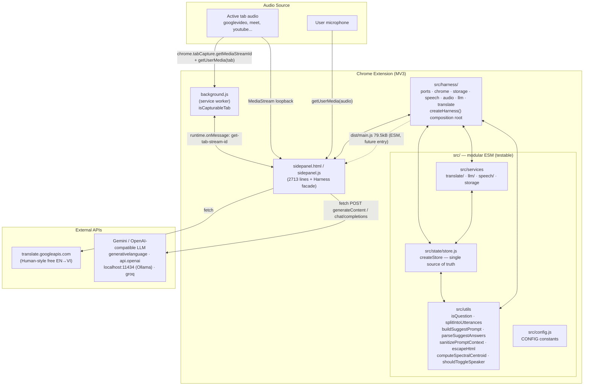
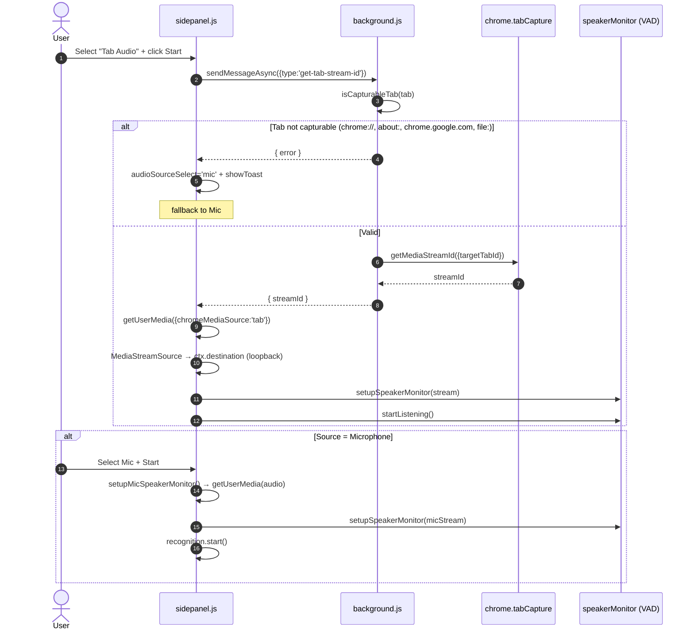
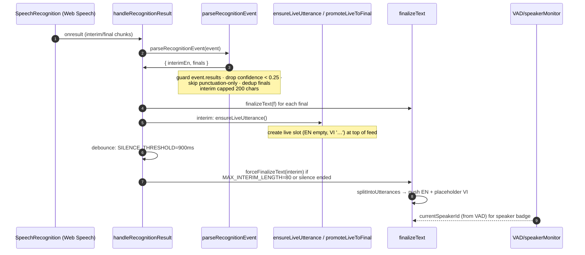
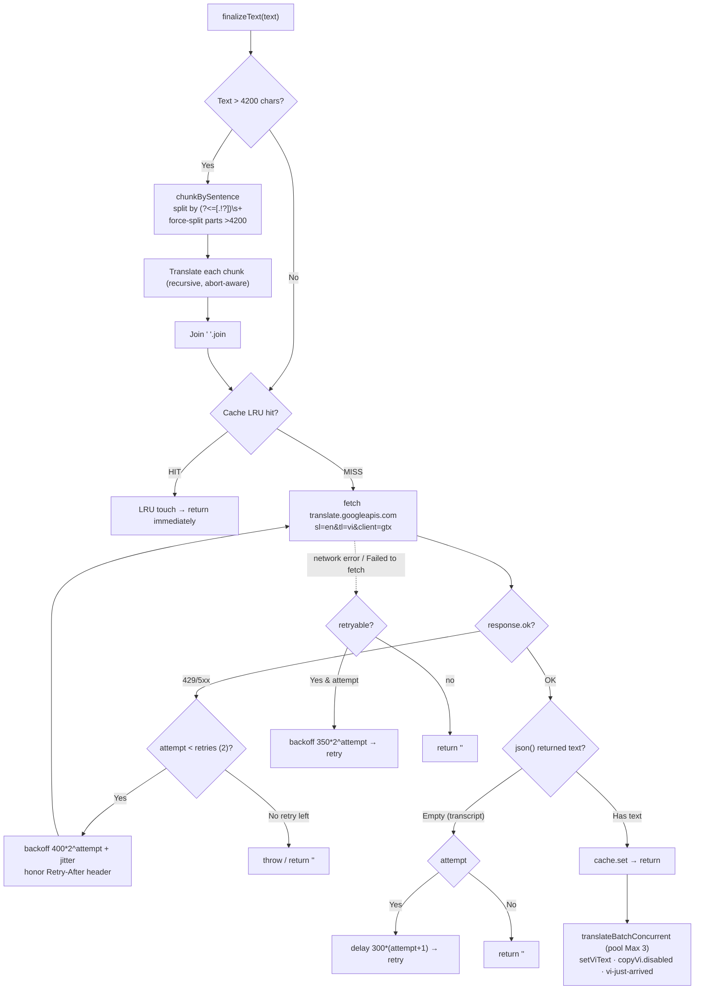
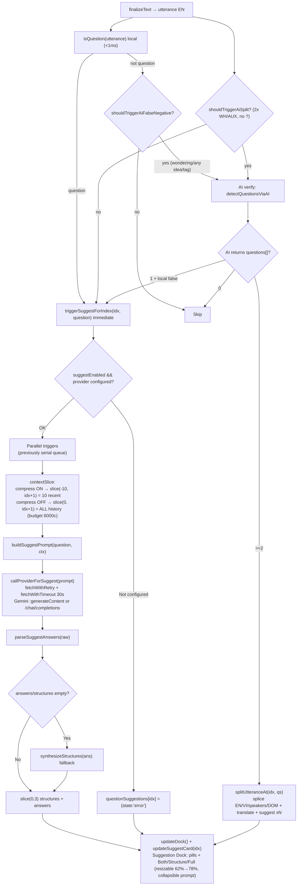
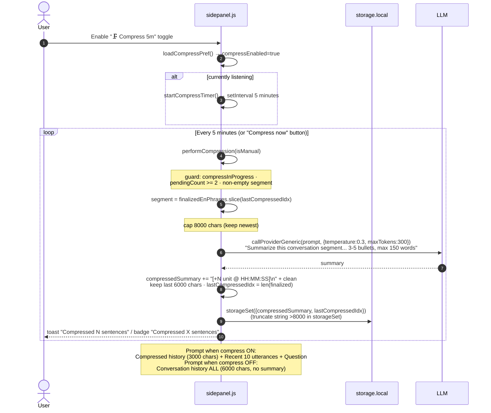
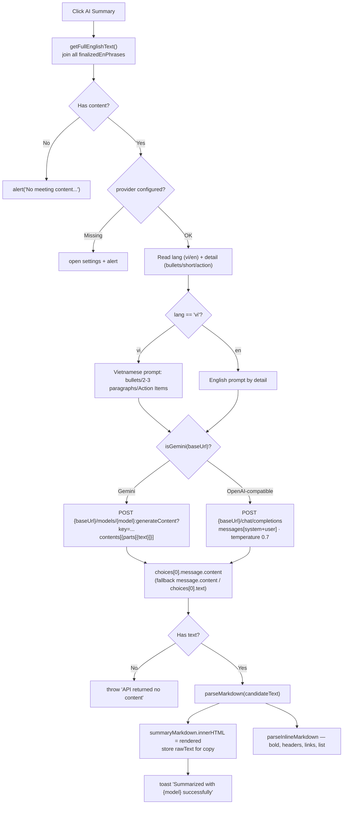
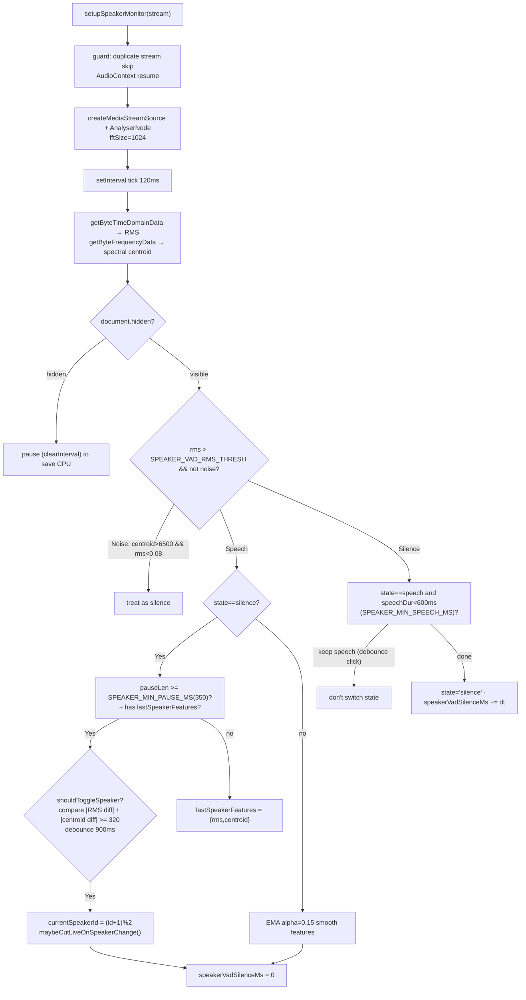
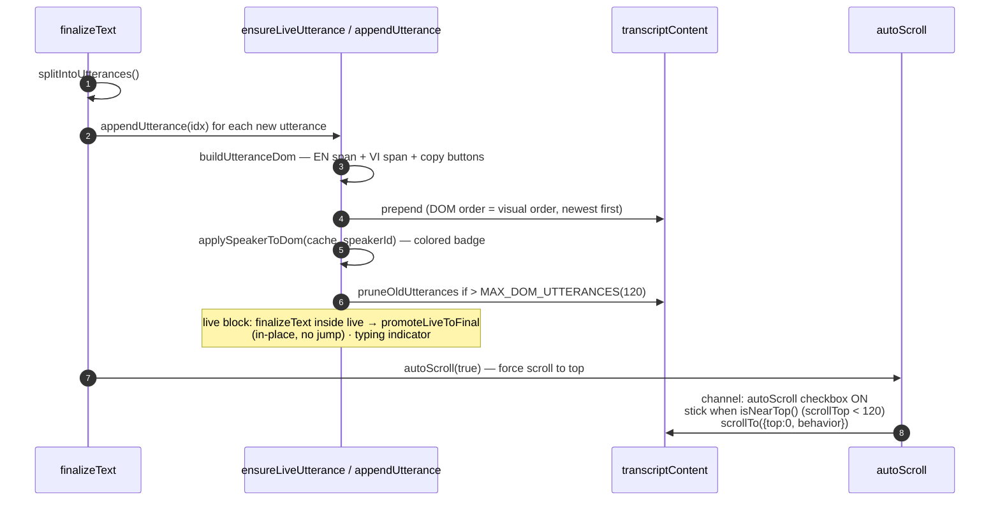

# Live Translate (EN → VI) — Chrome Side Panel Extension

Real-time English speech-to-text + Vietnamese translation + AI-powered suggested answers in Chrome Side Panel. Supports **Tab Audio** (`chrome.tabCapture`) and **Microphone**; auto-translation via **Google Translate free API**; answer suggestions, 5-minute history compression and meeting summarization via **Gemini / OpenAI-compatible provider** (OpenAI, Ollama, Groq).

Version **1.3.0** · MV3 · MIT · [Harness & Compression Agent](harness.md)


---

## Architecture Overview



> **Harness 1.1.0:** `src/harness/*` (7 files) là tầng duy nhất tiếp xúc `chrome`/`window`/`fetch`. Core (`src/services`, `utils`, `store`) chỉ import từ `harness`. `sidepanel.js:139` thêm `Harness` facade (delegate, không xóa logic cũ) nên UI không break. Chi tiết xem [harness.md](harness.md). `src/` không còn dead-code — `src/main.js` là composition root `createHarness()` và build `dist/main.js`.

---

## Features

- **Realtime Transcription**: Web Speech API (`en-US`, `continuous` + `interimResults`), `SILENCE_THRESHOLD = 900ms`.
- **Auto EN→VI Translation**: Google Translate free API per utterance, `>4200 chars` chunking, retry/backoff, 500-entry LRU cache.
- **Tab Audio & Mic**: `chrome.tabCapture.getMediaStreamId` + loopback via `AudioContext`, fallback to mic if tab is not capturable.
- **AI Answer Suggestions**: `isQuestion()` local gate → hybrid AI verify (`shouldTriggerAiDetect` + `questionDetect` LLM) for multi-question split (`Where are you from where were you born` → 2 pills) → `buildSuggestPrompt()` → LLM → `parseSuggestAnswers()` → Suggestion Dock (Both / Structure / Full, resizable + collapsible prompt).
- **Rolling 5-Minute Compress**: `🗜️ Compress 5m` toggle — compresses history every 5 minutes into bullet summaries; follow-up prompts use `compressed history + 10 most recent sentences`.
- **AI Summary**: `generateSummary()` supports native Gemini (`:generateContent`) and OpenAI-compatible (`/chat/completions`).
- **Speaker diarization heuristic**: Local VAD (RMS + spectral centroid) to distinguish 2 speakers.
- **UI**: Single transcript feed (EN white / VI yellow), reverse layout — *newest on top*, live block + typing indicator, suggestion dock `62%` default / `78%` expanded, resizable handle, collapsible Context prompt, Context Inspector `Questions` tab shows **all questions**.

---

## Flow 1 — Startup & Capture (Tab Audio / Mic)



`isCapturableTab` (mirrored in `background.js:11` and `src/background/isCapturableTab.js`):
- Only allows `http:` / `https:`.
- Blocks `chrome://`, `chrome-extension://`, `about:`, `edge://`, `file:`.
- Blocks hosts `chrome.google.com`, `chromewebstore.google.com`, `accounts.google.com`.

---

## Flow 2 — STT → Utterance → Live block



**Error handling / auto-restart** (`handleRecognitionError` / `handleRecognitionEnd`):

| Error | Handling |
|---|---|
| `not-allowed` / `service-not-allowed` | show Permission overlay + stop |
| `no-speech` / `aborted` | ignore, auto-restart |
| `audio-capture` | toast "Mic not found" + stop |
| `network` | toast "STT network error — retrying", keep running |
| other | toast + stop |

`onend` → if still listening: reset `lastFinalIndex=-1`, auto-restart after **300ms**.

---

## Flow 3 — Translation EN→VI (Google Translate + chunk + retry + LRU)



**Module details `src/services/translate/`:**

| File | Role |
|---|---|
| `translate.js` | `translateText()` — 4200 chunking, 2 retries (429/5xx/network/empty), timeout `TRANSLATE_TIMEOUT_MS=8500`, linked external abort, `_internals` for tests |
| `cache.js` | `createTranslateCache(limit=500)` — real LRU, `safeLimit` clamped 1..2000, `get/set/has/delete/clear/size/keys` |
| `batch.js` | `translateBatchConcurrent(tasks, {concurrency=3})` — worker pool, skips tasks that already have VI, `'[Translation failed]'` not marked as final value, `results.failed` telemetry |

> (`sidepanel.js:1419` keeps equivalent inline logic — manual sync.)

---

## Flow 4 — Question Detection & AI Answer Suggestions (hybrid local + LLM)



**`isQuestion()` — detection layers** (`sidepanel.js:704-717`, `src/utils/isQuestion.js:1-8`):

0. **STT Normalize**: strip `s/n` prefix before WH (`s How are you` → `How are you`), fix fused `youestion → you`.
1. Fast: contains `?` → true.
2. `window.nlp` (compromise) if available → `doc.questions()`.
3. Exclude exclamations: `What a ...!`, `How great ...!`.
4. **Comma-concat**: `How are you, Today I will...` → check left clause before `,` if WH/AUX then true.
5. **Declarative trap** `RE_DECLARATIVE_FALSE`: `This is correct.` is not a question (unless tag/trailing `or`/embedded); no-comma tag `right/ok/yeah` has guard to avoid `are right` adjective.
6. `RE_WH_START`: `who/what/when/where/why/how/which/...` + contractions `what's|how's|...` (≥2 words, not ending with `!`).
7. `RE_AUX_START`: auxiliary inversion `is|are|do|does|did|can|could|will|would|have|...`.
8. `RE_TAG_Q` (with comma): `, right?`, `, isn't it?`, `, okay?` + `RE_TAG_Q_NOCOMMA` (no comma): `right|ok|yeah|yep|huh` (≥3 words, `are right` guard).
9. `RE_EMBEDDED`: `do you|can you|would you mind|could you tell|how are you|...` (≥4 words).
10. `RE_INDIRECT`: `do you know|tell me|any chance|let me know|...` (≥3 words).
11. `RE_TRAILING_OR`: `or not|or what|or something|anything|somewhere` (≥4 words).

**`splitIntoUtterances()`** (`sidepanel.js:1232`, `src/utils/splitIntoUtterances.js:1-43`): `SENT_END_RE` + `ABBREVS` merge → iterative queue → `STRONG_SPLIT how/what/...` (prefix≥3) → `hows/whats` → `findQuestionDeclarativeSplit` Q→A (`what's your name`→`my name is Esther`) → comma-split → `isNoiseUtterance` filters `S`/`h one...`→`one...`, normalizes `e okay`/`youestion`.

**Hybrid AI supplement — `shouldTriggerAiDetect` + `questionDetect`** (`src/utils/shouldTriggerAiDetect.js`, `src/services/llm/questionDetect.js`, mirrored `sidepanel.js:956`):
- Gate `shouldTriggerAiSplit` (2× WH/AUX, no `?`, `words≥6`) + `shouldTriggerAiFalseNegative` (`wondering if`/`any idea`/tag) → only ~5-10% utterances call LLM.
- `buildDetectPrompt` → `{"questions":["q1","q2"]}` (temp 0.2, maxTokens 256, validate 50% word overlap, dedup cache 200). If `local false + AI 1` → `triggerSuggest`; if `AI ≥2` → `splitUtteranceAt` (splice EN/VI/speakers/DOM, re-translate, re-suggest).

**`triggerSuggestForIndex` in parallel**: removed serial `suggestQueue`, each `isQuestion` sets `loading` then calls `callProviderForSuggest` in parallel; `updateDock` auto-scrolls pills bar (`scrollLeft=scrollWidth` + `scrollIntoView` active). Dock is now resizable (drag handle, double-click expand 62%→78%) and `Suggestion Context` is collapsible (collapsed by default).

**`buildSuggestPrompt()`** — injection protection: `sanitizePromptContext` replaces `"""` → `"'"` before embedding in prompt block; `truncateForPrompt` caps context (compress ON: 1500 chars recent + 3000 chars summary / compress OFF: 6000 chars ALL history).

**Provider** (`src/services/llm/provider.js`):
- `fetchWithTimeout(url, opts, timeout)` — internal AbortController linked to external `signal`.
- `fetchWithRetry(url, opts, timeout, maxRetries=2)` — retry on 429/500/502/503/504 + `Retry-After`, drains body.
- `callProviderForSuggest` — mandatory "ONLY JSON" systemPrompt (OpenAI-compatible), Gemini uses `temperature 0.8, maxOutputTokens 512`.
- `callProviderGeneric(prompt, cfg, {temperature=0.4, maxTokens=512, systemPrompt, timeout=25000})` — used for compression + questionDetect (0.2/256).

**`parseSuggestAnswers()`** — strips JSON code fence wrapper (including `` ```json ... ``` `` blocks), `tryParseJson` (removes trailing commas), accepts `{structures,answers}` or single array, fallback to bullet lines (≥3 chars), limit 5.

---

## Flow 5 — Rolling 5-Minute Compress (context-aware suggestions)



* **Compress OFF**: `contextSlice = finalizedEnPhrases.slice(0, idx+1)` → `buildSuggestPrompt` → `Conversation history (all utterances, budget 6000 chars)` — full history (truncated tail) so suggestions have full context.
* **Compress ON**: `contextSlice = finalizedEnPhrases.slice(max(0, idx-10+1), idx+1)` (10 sentences) + `compressedSummary` 3000c → prompt `Compressed history + Recent 10`.

**Context Inspector** (`src/ui/components/contextInspector.js` / `sidepanel.js:377`): `Pending` tab now shows **all questions** (`allQuestions = en.filter(isQuestion)`, not just `pendingSegment`), with `[#idx]` + header `All questions (N) — pending …`. `Live` tab = prompt that will be sent for next Q (compressed history + recent when ON / ALL history 6000c when OFF), `History` = `compressedSummary`.

---

## Flow 6 — AI Summary

> Unchanged per spec — `generateSummary` / `parseMarkdown` / `parseInlineMarkdown` remain as-is.



`parseMarkdown` handles: `###`/`##` headers → `<h3>`/`<h4>`, `**bold**`, `- bullets`, `` `code` ``, URLs → `<a target=_blank>`.

---

## Flow 7 — VAD & Speaker Diarization (heuristic)



---

## Flow 8 — Utterance → DOM (newest on top) & Scroll



**XSS protection:** all user/LLM content goes through `escapeHtml()` (`& < > " ' \``). `DOMPurify` is in `package.json` and imported in `src/main.js` (new module), not yet used in `sidepanel.js` runtime.

---

## CONFIG (`src/config.js` ↔ `sidepanel.js` — mirror)

| Constant | Value | Meaning |
|---|---|---|
| `SILENCE_THRESHOLD` | 900 ms | force-finalize interim after silence |
| `MAX_INTERIM_LENGTH` | 80 | early finalize if interim reaches 80 chars |
| `MAX_DOM_UTTERANCES` | 120 | prune old DOM when exceeding threshold |
| `INTERIM_DEBOUNCE_MS` | 420 | debounce interim translation (reduced from 500) |
| `TRANSLATION_CACHE_MAX` | 500 | LRU translation cache size |
| `MAX_CONCURRENT_TRANSLATE` | 3 | concurrent translation pool |
| `COMPRESS_INTERVAL_MS` | 5 min | auto-compress frequency |
| `COMPRESS_RECENT_KEEP` | 10 | recent utterances kept in compressed prompt |
| `COMPRESS_MAX_CHARS` | 3000 | cap for compressedSummary when building prompt |
| `SPEAKER_VAD_RMS_THRESH` | 0.012 | RMS threshold considered "speech" |
| `SPEAKER_MIN_PAUSE_MS` | 350 | minimum pause to consider speaker switch |
| `SPEAKER_MIN_SPEECH_MS` | 600 | minimum speech duration before switching to silence |
| `SPEAKER_CENTROID_DIFF` | 320 | minimum centroid diff to switch speaker |
| `TRANSLATE_TIMEOUT_MS` | 8500 | per-request translation timeout (increased from 8000) |

---

## Installation

1. Clone:

   ```bash
   git clone https://github.com/nbhson/app-live-translate-extension.git
   ```

2. Open `chrome://extensions` → enable **Developer mode** → **Load unpacked** → select the repo folder.
3. Click the extension icon to open the Side Panel. Configure the AI Provider on first run via `⚙️`.

## AI Provider Configuration

- **Base URL**: `https://generativelanguage.googleapis.com/v1beta` (Gemini) / `https://api.openai.com/v1` / `http://localhost:11434/v1` (Ollama) / `https://api.groq.com/openai/v1`.
- **API Key**: `AIza...` / `sk-...` (leave empty for localhost).
- **Model**: `gemini-2.5-flash`, `gpt-4o-mini`, `llama3.1`, ...
- Stored in `chrome.storage.local` (`providerBaseUrl`, `providerApiKey`, `providerModel`). 1-click preset chips. `isValidProviderConfig()` checks `http/https` + non-empty model.

## Usage

1. Select source (Tab Audio / Microphone) → **Start** (or Space).
2. Speak English → realtime EN/VI transcript. Questions are highlighted with `?` and auto-generate suggestions in the dock.
3. Enable `🗜️ Compress 5m` for long sessions (>15 min) so suggestions stay grounded in full history.
4. **AI Summary** tab → choose `VI/EN` + `Detailed/Short/Actions` → **Summarize** → Copy.

### Shortcuts

- **Space** — Start/Stop (see `setupKeyboardShortcuts`, `sidepanel.js:2396`).
- Copy button on each transcript tile / suggestion card.

## Permissions

```
permissions:        sidePanel, activeTab, storage, tabCapture
host_permissions:   https://translate.googleapis.com/*, generativelanguage.googleapis.com/*,
                    api.openai.com/*, api.groq.com/*, http://localhost/*, http://127.0.0.1/*
optional_host:      https://*/*            (add if custom URL needed → validated via isValidUrl)
```

## Development

```bash
npm install
npm test               # vitest run --coverage  (20 suites / 166 tests)
npm run test:watch
npm run build          # vite build → dist/main.js (91.1 kB, gzip 27.9 kB)
node --check sidepanel.js   # syntax check runtime script
```

**Checklist when editing code:**
1. Keep the **mirror** `sidepanel.js` ↔ `src/` (same behavior). If you change anything in `src/`, mirror it in `sidepanel.js`.
2. `npm test` must not fail.
3. `node --check sidepanel.js && npm run build`.
4. Reload extension: `chrome://extensions` → Reload → test both Tab Audio and Mic.

### Writing tests

```
tests/
  buildSuggestPrompt.test.js      — 4 ctx vs compress 10 ctx + 3000 truncation, sanitize triple-quotes, context injection
  isQuestion.test.js              — 17 cases (?, WH-start, aux, tag, embedded, indirect, exclamation, declarative trap, STT noise s/n+youestion, no-comma tag, comma-concat, what/how about, wondering/polite)
  splitIntoUtterances.test.js     — 15 cases (empty, punctuation, WH keep, mid-split how, abbrev merge Mr./Dr., Safari fallback, STT normalize, comma-concat, no-punct concat, multi Q+A)
  parseSuggestAnswers.test.js     — object/array/bullet fallback, limit 5, synthesizeStructures, code fence
  sanitizePromptContext.test.js   — trim/slice, null-safe, triple-quote escape (matches new fix)
  contextInspector.test.js        — live/compressed/empty + allQuestions count + truncates
  isCapturableTab.test.js         — schemes, chrome://, about:, blocked hosts
  computeSpectralCentroid.test.js — edge & branch
  shouldToggleSpeaker.test.js     — rms/centroid diff, debounce window
  escapeHtml.test.js              — entities
  harness.test.js / compressionAgent.test.js — Harness 6 ports + Compression Agent 3 tools
```

> **On tests:** `src/utils` ~94–100%, `src/services/translate` 89%, `src/services/llm` 93%, `src/harness` 46% (mới). Xem `harness.md:5` chi tiết.

## File map

| File | Role | Notes |
|---|---|---|
| `sidepanel.js` | Main runtime + `Harness` facade (`sidepanel.js:139`) | ~3100 lines; delegate tới `Harness.*` + hybrid AI questionDetect + resizable dock |
| `sidepanel.html` / `sidepanel.css` | Layout & style | `dist/main.js` (91 kB) sẵn sàng; dock resizer + collapsible prompt + expanded 78% |
| `background.js` | SW: sidePanel behavior + `get-tab-stream-id` | dùng `isCapturableTab` pure |
| `manifest.json` | MV3 manifest, permissions, icons | |
| `permission.html` / `permission.js` | Mic/capture permission overlay | |
| `src/harness/*` | Harness layer — 7 files, Ports/Adapters | composition root `createHarness()`, injectable mocks, xem `harness.md` |
| `src/main.js` | ESM entry — `createHarness()` + re-export | Vite build `dist/main.js` |
| `src/services/llm/questionDetect.js` | AI supplement for question split | `buildDetectPrompt`/`detectQuestionsViaAI` (temp 0.2) |
| `src/utils/shouldTriggerAiDetect.js` | Gate for AI calls | `shouldTriggerAiSplit/FalseNegative` (~5-10% LM calls) |
| `src/ui/components/contextInspector.js` | Context Inspector | `allQuestions` (pending tab = all questions) + live/compressed |
| `src/…` (services/utils/state/ui) | Pure core, không import `chrome` trực tiếp | testable, 166 tests |
| `tests/` | Vitest suites | 166 tests (20 suites, gồm harness + compressionAgent) |
| `lib/compromise.min.js` | Optional NLP for isQuestion | improves accuracy if loaded |
| `harness.md` | Kiến trúc Harness chi tiết | Ports, Adapters, flows, checklist không-break |

## Changelog

- **2026-09-20**: Pending all-questions + Suggestion dock tối ưu + Hybrid AI detect:
  - `contextInspector` (`src/ui/components/contextInspector.js:18`, `sidepanel.js:377`): `Pending` tab → **All questions** (`en.filter(isQuestion)` với `allQuestionsCount`, meta `• N questions`), giữ `pendingList` cho compress.
  - `sidepanel.html:146` + `sidepanel.css:589`: dock `62%→78%`, `dock-resizer` drag (persist `localStorage dockHeight`), `dock-expand-btn` ⛶, `Suggestion Context` collapsible (collapsed mặc định, auto-expand khi có value/focus), `Full` tab (rút gọn từ Full sentences), `Questions` tab (từ Pending).
  - Hybrid AI supplement (`src/utils/shouldTriggerAiDetect.js`, `src/services/llm/questionDetect.js`, `sidepanel.js:956`): gate `shouldTriggerAiSplit/FalseNegative` chỉ ~5-10% utterances gọi LLM `temp 0.2/256`, `validate 50% overlap`, `splitUtteranceAt` splice DOM + re-translate/re-suggest; false-negative `I was wondering…` → suggest.
- **2026-09-19d (Harness)**: Nâng lên tầng Harness — không break UI:
  - Thêm `src/harness/*` (7 files): `ports.js`, `index.js:createHarness()`, `storage/chrome/speech/audio/llm/translate.harness.js` — isolate `chrome/window/fetch`, injectable mocks.
  - `src/main.js:1` thành composition root `createHarness()` (build `dist/main.js` 79.5 kB).
  - `sidepanel.js:139` thêm `Harness` facade `Object.freeze` + `window.Harness` (delegate, hoisted, không xóa function cũ).
  - `tests/harness.test.js:1` 8 tests mới → 151 tests pass, coverage 65.8%.
  - Thêm `harness.md` (kiến trúc, ports, flows, checklist), update `README.md` diagram + file map.
- **2026-09-19c**: Fix fragment merge + filter structure vs complete answer mixing:
  - `isQuestion`: guard incomplete fragment `…to/for/with` (wait for next chunk), strip generic single-char noise `o success → success`, expanded single-char prefix strip for `okay/right/how's/what's`.
  - `parseSuggestAnswers` (`sidepanel.js:1042`, `src/utils/parseSuggestAnswers.js:1`): filter `answers` that look like structures (`" + "` + <12 words), keep `structures` separate — don't copy `structures → answers`.
  - `triggerSuggestForIndex` / `renderDockBody` (`sidepanel.js:1098`): validate complete answers ≥60 chars & ≥15 words; if only structures exist, dock shows only Structures instead of fake Complete answers.
  - `finalizeText` (`sidepanel.js:1396`): merge two consecutive finals when previous ends incomplete (`to/for/...`) + current is short tag (`success/yeah/right`) → `how to push yourself to` + `o success yeah` → `how to push yourself to success yeah` (pop old utterance, re-index `questionSuggestions`).
- **2026-09-19b**: Fix screenshot 2: `h one sentence okay ?` + parallel suggestions:
  - `splitIntoUtterances`: added `h one...`→`one...` strip (single-consonant noise), recursive iterative Q→A fix for `I'm doing well|what's your name|my name is Esther|how old are you|I'm 33...`.
  - `triggerSuggestForIndex`: removed serial queue → parallel, render all loading immediately; `updateDock` auto-scrolls right.
  - `isNoiseUtterance`: filter `S S`/`S`.
- **2026-09-19**: Fix display concat & suggestions from screenshot #1:
  - `isQuestion`: unchanged from 2026-09-18.
  - `splitIntoUtterances`: iterative queue, `findQuestionDeclarativeSplit` (Q→A `i'm/my name...`), normalize `e`+`okay` and `youestion`, `isNoiseUtterance` filter `S`/`S S`, strip `,`, recursive multi Q+A split (`where are you from|I'm from the US|where were you born|I was born...`).
- **2026-09-18**: Comprehensive overhaul (except Summary per spec):
  - Translation: 4200 chunking, retry backoff + `Retry-After`, proper LRU (`cache.js`), abort-aware worker pool (`batch.js`).
  - `isQuestion`: normalize `s/n`+`youestion`, comma-concat left-clause, `RE_TAG_Q_NOCOMMA` guard for `are right`, embedded `how are you`, contractions, tag words, `RE_DECLARATIVE_FALSE` trap.
  - `splitIntoUtterances`: normalize, `who/which`, abbrev merge, `\b` boundary, earliest split, STT contraction fallback, comma-concat + no-punct `How are you Today...`.
  - `parseSuggestAnswers`: code fence, trailing comma, min length.
  - `sanitizePromptContext`: fix `"""` injection → `"'"`, control chars.
  - Provider: `fetchWithTimeout` + `fetchWithRetry` (429/5xx/Retry-After), empty-response throw, validation.
  - Compress: segment cap 8000, error toast, re-read state after await.
  - STT/VAD: confidence<0.25 filter, punctuation-only skip, dedup finals, interim cap 200, error taxonomy, auto-restart 300ms, noise filter, `document.hidden` pause, EMA, min-speech debounce.
  - Storage: `lastError`-aware, size-cap 8000, `isValidProviderConfig`.
  - Config: `INTERIM_DEBOUNCE_MS 500→420`, `TRANSLATE_TIMEOUT_MS 8000→8500`.
  - Background: block `chrome://`, `about:`, `file:`, `chromewebstore.google.com`, `accounts.google.com`.
- **2026-09-17**: Added Rolling 5-minute Compress + toggle (B), generic LLM call, `compressedSummary` persistence, manual compress.
- **Before**: speaker VAD diarization, sticky live block, mockup transcript, suggestion dock.

## License

MIT.
