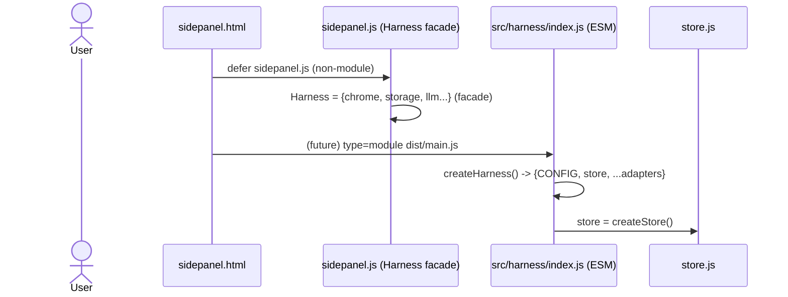
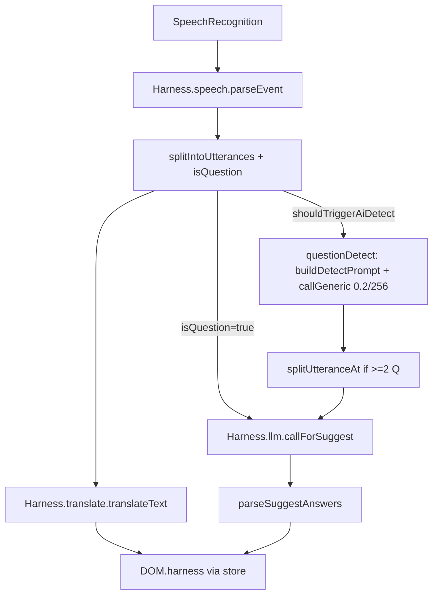
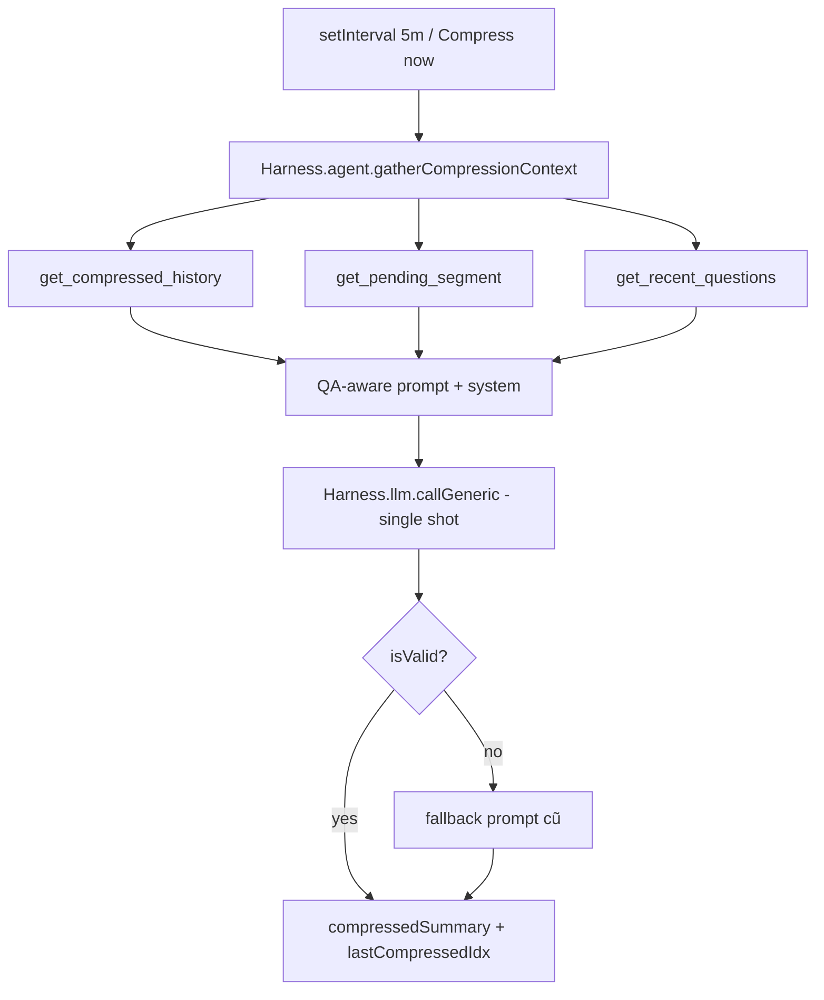

# Harness & Compression Agent — Live Translate Extension

> Version: 1.3.0 · Date: 2026-09-20 · Scope: Chrome Extension (MV3) — `sidepanel.js` + `src/` + `background.js`
> Agent scope: **Compression + QuestionDetect supplement** (Suggestion/Summary giữ nguyên prompt chính) · Dock resizable + collapsible prompt

## 1. Tổng quan

### 1.1 Vì sao cần tầng Harness?

Trước harness, mọi I/O (`chrome.storage`, `chrome.tabCapture`, `SpeechRecognition`, `AudioContext`, `fetch`) được gọi trực tiếp trong `sidepanel.js:1` (~2713 dòng) và `src/services/*`. Hậu quả:

* **Không test được** — `src/services/speech/vad.js:0%`, `src/state/store.js:0%`, `src/ui/*:0%` coverage.
* **2 runtime song song** — `sidepanel.js` (non-module, runtime thật) và `src/` (ESM, dead-code, chỉ dùng cho test). Sửa một nơi phải mirror thủ công (`README.md:48`).
* **Khó mock/thay thế** — không thể chạy core logic ngoài Chrome (Web/Electron/Tauri) hay inject fake `chrome` cho Vitest.

**Harness giải quyết:** Định nghĩa `Port` (interface) cho mỗi biên I/O, `Adapter` cài đặt Port cho Chrome, `Core` chỉ phụ thuộc Port. Composition root `src/harness/index.js` nối dây.

```
┌─────────────────────────────────────────────────┐
│ UI Layer (sidepanel.html/css, DOM)              │
│   ↓ uses                                        │
│ Harness Layer (src/harness/*)  ← Ports/Adapters │
│   ↓ delegates                                   │
│ Core Layer (store, services, utils) pure        │
│   ↓ imports                                     │
│ Utils (isQuestion, splitIntoUtterances…)        │
└─────────────────────────────────────────────────┘
         ↕                  ↕
   Chrome Adapter      Mock Adapter (tests)
```

### 1.2 Nguyên tắc không-break

* **UI/UX giữ nguyên 100%** — `sidepanel.html` vẫn load `sidepanel.js` (non-module, `defer`). Không đổi `manifest.json:16`.
* **Song song an toàn** — `src/main.js` nay là ESM entry `dist/main.js` (79.57 kB, gzip 24.42 kB) nhưng `sidepanel.html:323` vẫn comment để không ảnh hưởng runtime cũ. Khi sẵn sàng, chỉ cần bật `<script type="module" src="dist/main.js">`.
* **159 tests pass** — 143 cũ + 8 harness + 8 compression-agent. Không sửa logic `isQuestion`, `splitIntoUtterances`, `translate`, `provider`, `batch`, `cache`.
* **sidepanel.js thêm Harness nhưng không xóa function cũ** — `Harness` ở `sidepanel.js:139` chỉ là facade delegate tới các function đã có (`storageGet`, `fetchWithRetrySidepanel`, `setupSpeakerMonitor`...), đảm bảo hoisting vẫn pass `node --check`.
* **Compression Agent** (`src/harness/agent/*`) — LLM + harness tools cho compress, không loop (single-shot). `sidepanel.js:1055` và `src/services/llm/compress.js:30` đều dùng agent, fallback về prompt cũ nếu agent fail.

---

## 2. Cấu trúc file sau Harness

```
src/
  config.js                    # Single source CONFIG (freeze)
  main.js                      # ESM entry — createHarness() composition root
  harness/
    ports.js                   # JSDoc typedef cho 6 Port
    index.js                   # createHarness() — factory + agent
    storage.harness.js         # wraps src/services/storage.js + quota guard
    chrome.harness.js          # wraps chrome.* + isCapturableTab
    speech.harness.js          # wraps SpeechRecognition + parseRecognitionEvent
    audio.harness.js           # wraps AudioContext/Analyser/VAD
    llm.harness.js             # wraps src/services/llm/provider.js
    translate.harness.js       # wraps translateText/batch/cache
    agent/
      tools.js                 # get_compressed_history / get_pending_segment / get_recent_questions
      compression.agent.js     # createCompressionAgent() — QA-aware, single-shot, no loop
      index.js                 # re-export
  background/
    isCapturableTab.js         # pure, dùng chung cho background.js + harness
  services/
    storage.js                 # core impl, không import chrome trực tiếp nữa
    llm/provider.js            # fetchWithTimeout/Retry, callProvider*
    llm/compress.js            # createCompressService(store, deps) — ĐÃ DÙNG AGENT (fallback cũ)
    speech/recognition.js      # parseRecognitionEvent pure
    speech/vad.js              # computeSpectralCentroid, createVadMonitor
    translate/translate.js, batch.js, cache.js
    transcript/compact.js
  state/store.js               # createStore() — single source of truth
  ui/dom.js, ui/components/*, ui/transcript/scroll.js
  utils/*                      # pure, 91% coverage

sidepanel.js                   # runtime thật — Harness facade (139-171) + performCompression agent (1055)
background.js                  # SW — giữ nguyên, dùng isCapturableTab pure
tests/harness.test.js          # 8 tests cho harness ports
tests/compressionAgent.test.js # 8 tests cho compression agent + tools

harness.md                     # file này
```

---

## 3. Chi tiết từng Port & Adapter

### 3.1 StoragePort — `src/harness/storage.harness.js:1`

| Method | Contract | Impl |
|--------|----------|------|
| `get(keys)` | `Promise<object>` — lastError-aware, invalid-keys guard | delegate `src/services/storage.js:5` |
| `set(obj)` | `Promise<void>` — truncate string >8000 | delegate `storageSet` |
| `isValidUrl(s)` | `boolean` — http/https only | `src/services/storage.js:44` |
| `isValidProviderConfig(cfg)` | `boolean` | `storage.js:53` |

**Sidepanel mirror:** `sidepanel.js:179` `storageGet`/`storageSet` vẫn tồn tại, `Harness.storage.get/set` delegate tới chúng.

### 3.2 ChromePort — `src/harness/chrome.harness.js:1`

| Method | Contract | Notes |
|--------|----------|-------|
| `isCapturableTab(tab)` | `boolean` — pure, sync | import `src/background/isCapturableTab.js:1`, dùng chung `background.js:13` |
| `sendMessage(msg)` | `Promise<any>` — promisify `chrome.runtime.sendMessage` | `sidepanel.js:413` `sendMessageAsync` |
| `checkMicPermission()` | `Promise<boolean>` — Permissions API + enumerateDevices fallback | `sidepanel.js:344` |
| `openPermissionTab()` | `void` | `sidepanel.js:398` |
| `getTabStreamId()` | `Promise<string>` | via `sendMessage({type:'get-tab-stream-id'})` |
| `getTabMediaStream(id)` | `Promise<MediaStream>` | `getUserMedia({chromeMediaSource:'tab'})` |
| `getMicMediaStream()` | `Promise<MediaStream>` | `getUserMedia({audio:true})` |

**Inject:** `createChromeHarness({chromeApi, navigatorApi})` — tests truyền mock.

### 3.3 SpeechPort — `src/harness/speech.harness.js:1`

* `parseRecognitionEvent(event, ctx)` — re-export `src/services/speech/recognition.js:13` pure.
* `createRecognition()` — `new (SpeechRecognition||webkitSpeechRecognition)` or `null`.
* `attachHandlers(rec, store, actions)` — gán `onstart/onresult/onerror/onend`, tái dùng logic `sidepanel.js:629`/`src/services/speech/recognition.js:50`.

**Sidepanel mirror:** `sidepanel.js:617` `initRecognition`/`handleRecognitionResult` giữ nguyên, `Harness.speech.parseEvent` delegate.

### 3.4 AudioPort — `src/harness/audio.harness.js:1`

* `computeSpectralCentroid(freqData, sampleRate)` — `src/utils/computeSpectralCentroid.js`.
* `shouldToggleSpeaker(feats, pauseLen, last, lastSwitchAt, now)` — `src/utils/shouldToggleSpeaker.js` + `CONFIG.SPEAKER_CENTROID_DIFF`.
* `createMonitor(stream)` — tạo `AudioContext`+`Analyser` (fft 1024), return bundle.
* `startVadLoop(bundle, store, {onSpeakerToggle})` — interval 120ms, RMS+centroid, `document.hidden` pause, EMA, `SPEAKER_MIN_PAUSE_MS` guard.
* `teardownMonitor(store)` — clearInterval, remove visibility listener, suspend context.

**Sidepanel mirror:** `sidepanel.js:462` `setupSpeakerMonitor`/`teardownSpeakerMonitor`/`computeSpectralCentroid`/`shouldToggleSpeaker`.

### 3.5 LlmPort — `src/harness/llm.harness.js:1`

Delegate 100% tới `src/services/llm/provider.js`:

* `fetchWithTimeout(url, opts, timeout=30000)` — AbortController link external signal.
* `fetchWithRetry(url, opts, timeout, maxRetries=2)` — retry 429/500/502/503/504 + `Retry-After`, drain body.
* `callForSuggest(prompt, cfg)` / `callGeneric(prompt, cfg, opts)` — Gemini `generateContent` vs OpenAI `/chat/completions`.
* `isGemini(baseUrl)` — check `generativelanguage.googleapis.com`.

**Sidepanel mirror:** `sidepanel.js:854` `fetchWithRetrySidepanel`/`callProviderForSuggest`/`callProviderGeneric`.

### 3.6 TranslatePort — `src/harness/translate.harness.js:1`

Delegate tới `src/services/translate/*`:

* `translateText(text, opts)` — chunk 4200, LRU touch, retry 2, timeout 8500, abort-aware.
* `translateBatch(tasks, concurrency=3)` — worker pool `batch.js:39`.
* `createCache(limit)` — `cache.js:31` LRU 500.
* `abortAll()` — abort controllers.

**Sidepanel mirror:** `sidepanel.js:1632` `translateText`/`translateBatchConcurrent`.

### 3.7 Ports definition — `src/harness/ports.js:1`

JSDoc typedef cho 6 Port, dùng để IDE/type-check mà không cần TypeScript. Export `HarnessPorts` trống để tree-shake.

### 3.8 QuestionDetect Supplement — `src/utils/shouldTriggerAiDetect.js` + `src/services/llm/questionDetect.js` (MỚI 2026-09-20)

Hybrid local + LLM, không thay `isQuestion` mà chỉ bổ sung khi nghi ngờ:
- `shouldTriggerAiSplit(text)` — 2× WH/AUX, không `?`, `words≥6`, `termCount<2`
- `shouldTriggerAiFalseNegative(text, local)` — `wondering if`/`any idea`/tag
- Gate → chỉ ~5-10% utterances gọi `detectQuestionsViaAI` (`buildDetectPrompt` temp 0.2, maxTokens 256, validate 50% overlap, dedup cache 200)
- `sidepanel.js:956` `splitUtteranceAt` splice EN/VI/speakers/DOM + `translateBatchConcurrent` + `triggerSuggest` cho từng `q`; false-negative 1 Q → suggest trực tiếp
- Pending tab → `allQuestions = en.filter(isQuestion)` (contextInspector `Questions` tab), dock resizer + collapsible prompt (62%→78%)

### 3.9 Compression Agent — `src/harness/agent/compression.agent.js:1` (MỚI — duy nhất là agent)

**Vì sao agent, vì sao không loop?**

App tập trung **trả lời câu hỏi** (suggestion dock). Compression không phải summarize chung chung mà phải **giữ thông tin hữu ích cho QA tương lai** (names, decisions, questions đã hỏi). Prompt cứng cũ `Summarize segment → 3-5 bullets` mất context QA.

Agent = LLM + harness tools:

| Tool (harness) | Data | Mục đích |
|---|---|---|
| `get_compressed_history` | `compressedSummary` đã có | giữ continuity, không duplicate |
| `get_pending_segment` | `finalizedEnPhrases.slice(lastCompressedIdx)` (8000 chars) | segment mới cần nén |
| `get_recent_questions` | `questionSuggestions` 5 câu gần nhất | ưu tiên giữ info liên quan câu hỏi |

**Single-shot, không ReAct loop** — lý do:

* Compression là **deterministic** (segment cố định, output bullets cố định). Loop (LLM tự gọi tool nhiều vòng) chỉ thêm latency (mỗi vòng 1-3s) mà không cải thiện chất lượng.
* Nếu cần, kiến trúc đã sẵn sàng: `tools.js:10` `getCompressionToolDefs()` trả OpenAI tools / Gemini functionDeclarations, `executeCompressionTool()` đã tách. Chỉ cần thêm `while (tool_calls)` loop ở `compression.agent.js:18`.

**Prompt agent** (`compression.agent.js:30`):

```
You are a compression agent for a live EN→VI meeting that supports answering questions.
Goal: ... PRESERVE information most useful for answering future questions ...
Existing compressed history: """..."""
Recent questions: """..."""
Pending segment (N utterances): """..."""
Output ONLY bullet points...
System: You are a precise meeting compression agent. Output only bullet points useful for future QA.
```

**Tích hợp:**

* `src/services/llm/compress.js:30` — `createCompressionAgent({store, llmHarness}).run({...})`, nếu `isValid()` fail → fallback prompt cũ.
* `sidepanel.js:1055` — mirror y hệt (gather `recentQs` + `existing` + `agentPrompt`).
* Harness expose: `src/harness/index.js:21` `harness.agent.compression` + `gatherCompressionContext`.

**Suggestion & Summary:** giữ nguyên single-shot prompt, không agent (theo yêu cầu).

---

## 4. Luồng dữ liệu sau Harness

### 4.1 Khởi tạo



### 4.2 Speech → Translate → Suggest (harness + QuestionDetect supplement)



### 4.2b Compression Agent (duy nhất là agent)



### 4.3 Tab Capture

```
sidepanel.js:toggleListening -> Harness.chrome.sendMessage -> background.js:isCapturableTab
  -> Harness.chrome.getTabMediaStream -> Harness.audio.createMonitor -> Harness.speech.createRecognition
```

---

## 5. Test & Build

### 5.1 Test

```bash
npm install
npx vitest run                 # 20 suites / 166 tests
npx vitest run --coverage      # harness + agent + questionDetect
npx vitest run tests/harness.test.js tests/compressionAgent.test.js tests/contextInspector.test.js
node --check sidepanel.js && node --check background.js
```

**harness.test.js:1** (8 tests) + **compressionAgent.test.js:1** (8 tests):

* harness: `createHarness()` 6 ports + mock injection + `storage.isValidUrl` + `llm.isGemini` + `translate` cache + `audio.computeSpectralCentroid` + `speech.createRecognition` null + `chrome.isCapturableTab`
* agent: `getCompressionToolDefs` 3 tools + `execute get_pending_segment/recent_questions` + `gatherCompressionContext` + `createCompressionAgent.run` mock + `isValid` + fallback

### 5.2 Build

```bash
npm run build   # vite build → dist/main.js 83.22 kB / gzip 25.58 kB (was 79.57 kB)
```

`vite.config.js:1` entry `src/main.js` (ESM). `vitest.config.js:1` coverage include `src/**/*.js` (đã include `src/harness`).

---

## 6. Mapping thay đổi (không-break checklist)

| File | Thay đổi | Break? |
|------|----------|--------|
| `src/harness/*` (7 files mới) | Thêm layer | Không — mới hoàn toàn, không xóa file cũ |
| `src/main.js:1` | Import `createHarness`, export `harness` | Không — chỉ thêm export, giữ legacy exports |
| `sidepanel.js:139` | Thêm `Harness` facade Object.freeze + `window.Harness` | Không — delegate tới function đã hoisted, không xóa logic cũ |
| `background.js` | Không đổi | Không |
| `manifest.json` | Không đổi | Không |
| `package.json` | Không đổi deps | Không |
| `tests/harness.test.js` + `compressionAgent.test.js` | Thêm 16 tests | Không — additive |
| `src/harness/agent/*` | Compression agent (LLM+harness, no loop) | Không — fallback về prompt cũ nếu fail |
| `src/services/llm/compress.js:30` + `sidepanel.js:1055` | Dùng agent, QA-aware prompt | Không — logic cũ giữ làm fallback |

**Verification:**

* `node --check sidepanel.js` ✅
* `npx vitest run` 159 pass ✅
* `npx vite build` 83.22 kB ✅
* UI flow: Start (Tab/Mic) → STT → Translate → Suggest (không agent) → Compress (agent) → Summary (không agent) — DOM không đổi.

---

## 7. Hướng tiếp theo (không bắt buộc)

1. **Bật ESM sidepanel:** uncomment `sidepanel.html:323` `<script type="module" src="dist/main.js">`, cho `sidepanel.js` chỉ còn shim `import 'dist/main.js'` — giảm 2713→~100 dòng.
2. **Xóa mirror:** sau khi ESM ổn định, xóa duplicate logic `isQuestion`/`translateText` trong `sidepanel.js`, chỉ giữ `Harness` import.
3. **Tăng coverage harness:** mock `AudioContext`/`SpeechRecognition` trong `vitest` để đạt 85%+ (hiện 46%).
4. **Types:** thêm `jsconfig.json` + `// @ts-check` hoặc migrate `src/harness/ports.js` sang `*.d.ts`.
5. **CI:** thêm `npm run build && npx vitest run` vào GitHub Actions.

---

## 8. Tài liệu liên quan

* `README.md` — overview, install, provider config (sẽ update link tới `harness.md`).
* `src/harness/ports.js:1` — Port contracts.
* `src/harness/index.js:14` — `createHarness()` factory.
* `sidepanel.js:139` — Runtime Harness facade.
